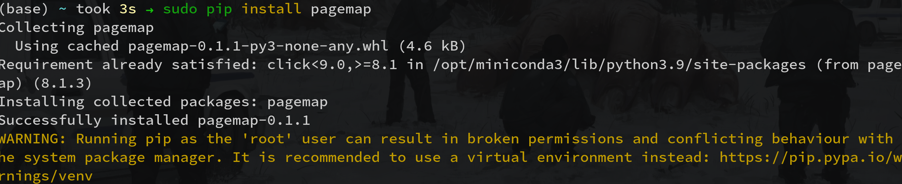
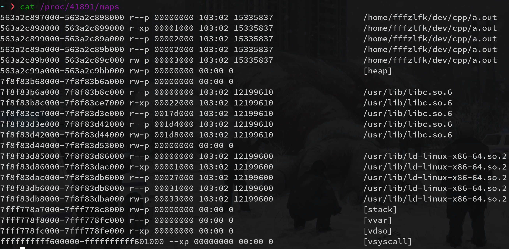
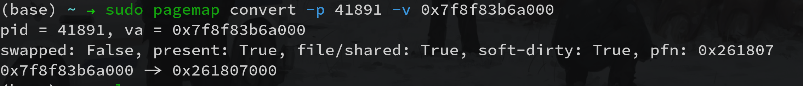
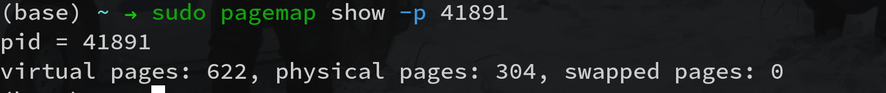

# pagemap

A tool for linux memory stats.

## 依赖

- Python 3.9+

## 安装

```terminal
sudo pip install pagemap
```



## 使用Demo



### 将该进程地址空间中任意的虚拟地址转换为对应的物理地址



### 统计输出该进程目前实际占用的虚拟内存页数量，物理内存页数量以及被交换到外存的虚拟内存页数量

